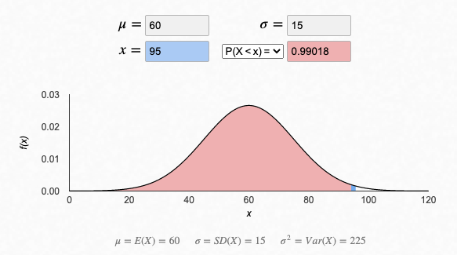
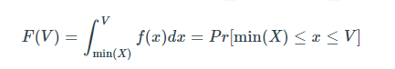

# Distribution Functions

## 1. Beyond Summary Statistics

Previously we covered summary statistics wherein we came to know some issues with that of the **weight** column which can be seen as follows:

```sql
SELECT
  ROUND(MIN(measure_value), 2) AS minimum_value,
  ROUND(MAX(measure_value), 2) AS maximum_value,
  ROUND(AVG(measure_value), 2) AS mean_value,
  ROUND(CAST(PERCENTILE_CONT(0.5) WITHIN GROUP (ORDER BY measure_value) AS NUMERIC), 2) AS median_value,
  ROUND(MODE() WITHIN GROUP (ORDER BY measure_value), 2) AS mode_value,
  ROUND(STDDEV(measure_value), 2) AS standard_deviation,
  ROUND(VARIANCE(measure_value), 2) AS variance_value
FROM
  health.user_logs
WHERE
  measure = 'weight';
```

Output:

| minimum_value | maximum_value | mean_value | median_value | mode_value | standard_deviation | variance_value   |
| ------------- | ------------- | ---------- | ------------ | ---------- | ------------------ | ---------------- |
| 0.00          | 39642120.00   | 28786.85   | 75.98        | 68.49      | 1062759.55         | 1129457862383.41 |

#### A few questions come to mind after looking at the above result.

- Does it make sense to have such low minimum values and such a high value?
- Why is the average value 28,786kg but the median is 75.98kg?
- The standard deviation of values is WAY too large at 1,062,759kg

## 2. Cumulative What?



In mathematical terms, a cumulative distribution function takes a value and returns us the percentile or the probability of any value between the minimum value of our dataset X and the value V as shown below:



This is how the output should look like for us to get a better picture of the distribution

| percentile | floor_value   | ceiling_value | percentile_counts |
| ---------- | ------------- | ------------- | ----------------- |
| 1          | 0             | 29.029888     | 28                |
| 2          | 29.48348      | 32.0689544    | 28                |
| 3          | 32.205032     | 35.380177     | 28                |
| 4          | 35.380177     | 36.74095      | 28                |
| 5          | 36.74095      | 37.194546     | 28                |
| 6          | 37.194546     | 38.101727     | 28                |
| ...        | ...           | ...           | ...               |
| 96         | 130.54207     | 131.570999146 | 27                |
| 97         | 131.670013428 | 132.776       | 27                |
| 98         | 132.776000977 | 133.832000732 | 27                |
| 99         | 133.89095     | 136.531192    | 27                |
| 100        | 136.531192    | 39642120      | 27                |

### 2.1. Algorithmic Thinking

For us to get an output similar to the one above, we'll be following the below steps to achieve the same.

1. Order all of the values from smallest to largest
2. Split them into 100 equal buckets - and assign a number from 1 through to 100 for each bucket
3. For each bucket:
   - calculate the minimum value and the maximum value for the ceiling and floor values
   - count how many records there are
4. Combine all the aggregated bucket results into a final summary table

### 2.2. SQL Implementation

Going by the above algorithm mentioned-

#### 2.2.1. Order and Assign

1. Order all of the weight measurement values from smallest to largest
2. Split them into 100 equal buckets - and assign a number from 1 through to 100 for each bucket

```sql
SELECT
  measure_value,
  NTILE(100) OVER (
    ORDER BY
      measure_value
  ) AS percentile
FROM health.user_logs
WHERE measure = 'weight'
```

Output:

| measure_value | percentile |
| ------------- | ---------- |
| 0             | 1          |
| 0             | 1          |
| 1.814368      | 1          |
| 2.26796       | 1          |
| 2.26796       | 1          |
| ...           | ...        |
| 190.4         | 100        |
| 200.487664    | 100        |
| 576484        | 100        |
| 39642120      | 100        |
| 39642120      | 100        |

#### 2.2.2.Bucket Calculations

3. For each bucket
   - calculate the minimum value and the maximum value for the ceiling and floor values
   - count how many records there are

```sql
WITH percentile_values AS (
  SELECT
    measure_value,
    NTILE(100) OVER (
      ORDER BY
        measure_value
    ) AS percentile
  FROM health.user_logs
  WHERE measure = 'weight'
)
SELECT
  percentile,
  MIN(measure_value) AS floor_value,
  MAX(measure_value) AS ceiling_value,
  COUNT(*) AS percentile_counts
FROM percentile_values
GROUP BY percentile
ORDER BY percentile;
```

Output:

| percentile | floor_value   | ceiling_value | percentile_counts |
| ---------- | ------------- | ------------- | ----------------- |
| 1          | 0             | 29.029888     | 28                |
| 2          | 29.48348      | 32.0689544    | 28                |
| 3          | 32.205032     | 35.380177     | 28                |
| 4          | 35.380177     | 36.74095      | 28                |
| 5          | 36.74095      | 37.194546     | 28                |
| 6          | 37.194546     | 38.101727     | 28                |
| ...        | ...           | ...           | ...               |
| 96         | 130.54207     | 131.570999146 | 27                |
| 97         | 131.670013428 | 132.776       | 27                |
| 98         | 132.776000977 | 133.832000732 | 27                |
| 99         | 133.89095     | 136.531192    | 27                |
| 100        | 136.531192    | 39642120      | 27                |

### 2.3. What Do I Do With This?

By carefully looking at the values for each percentile namely percentile-1 and percentile-100, following insights caught my eye:

1. 28 values lie between 0 and ~29KG
2. 27 values lie between 136.53KG and 39,642,120KG

| percentile | floor_value | ceiling_value | percentile_counts |
| ---------- | ----------- | ------------- | ----------------- |
| 1          | 0           | 29.029888     | 28                |
| 100        | 136.531192  | 39642120      | 27                |

When we look at the smaller values in the 1st percentile under 29Kg, a few things come to mind:

1. Maybe the values are measured incorrectly leading to some 0Kg weight
2. Some weights under 29Kg were actually valid for young children who were part of the customer base

Simmilarly for 100th percentile:

1. Does that 136Kg floor value actually makes sense??
2. How many error values were there actually in the dataset?

### 2.4. Large Outliers

> Let's take a deep dive into the 100th percentile values. Following SQL query gives us the row number order, rank and dense rank using ROW_NUMBER, RANK and DENSE_RANK functions.

Just to quickly summarize,

- ROW_NUMBER function assigns a unique sequential integer to each row in the result set based on the specified order.
- RANK function assigns a rank to each row based on the specified order.
- Similar to the RANK() function, DENSE_RANK() also assigns a rank to each row based on the specified order.

```sql
WITH percentile_values AS (
  SELECT
    measure_value,
    NTILE(100) OVER (
      ORDER BY
        measure_value
    ) AS percentile
  FROM health.user_logs
  WHERE measure = 'weight'
)
SELECT
  measure_value,
  -- these are examples of window functions below
  ROW_NUMBER() OVER (ORDER BY measure_value DESC) as row_number_order,
  RANK() OVER (ORDER BY measure_value DESC) as rank_order,
  DENSE_RANK() OVER (ORDER BY measure_value DESC) as dense_rank_order
FROM percentile_values
WHERE percentile = 100
ORDER BY measure_value DESC;
```

Output:
| measure_value | row_number_order | rank_order | dense_rank_order |
|---------------|------------------|------------|------------------|
| 39642120 | 1 | 1 | 1 |
| 39642120 | 2 | 1 | 1 |
| 576484 | 3 | 3 | 2 |
| 200.487664 | 4 | 4 | 3 |
| 190.4 | 5 | 5 | 4 |
| 188.69427 | 6 | 6 | 5 |
| 186.8799 | 7 | 7 | 6 |
| 185.51913 | 8 | 8 | 7 |
| 175.086512 | 9 | 9 | 8 |
| 173.725736 | 10 | 10 | 9 |
| 170.5506 | 11 | 11 | 10 |
| 170.5506 | 12 | 11 | 10 |
| 170.5506 | 13 | 11 | 10 |
| 164 | 14 | 14 | 11 |
| 157.5778608 | 15 | 15 | 12 |
| 149.68536 | 16 | 16 | 13 |
| 145.14944 | 17 | 17 | 14 |
| 144.242256 | 18 | 18 | 15 |
| 141.1578304 | 19 | 19 | 16 |
| 138.799152 | 20 | 20 | 17 |
| 137.438376 | 21 | 21 | 18 |
| 136.984784 | 22 | 22 | 19 |
| 136.984784 | 23 | 22 | 19 |
| 136.762008667 | 24 | 24 | 20 |
| 136.531192 | 25 | 25 | 21 |
| 136.531192 | 26 | 25 | 21 |
| 136.531192 | 27 | 25 | 21 |

> So it looks like there are at least 3 HUGE values which are outliers in our weight values in that top percentile.

| measure_value | row_number_order | rank_order | dense_rank_order |
| ------------- | ---------------- | ---------- | ---------------- |
| 39642120      | 1                | 1          | 1                |
| 39642120      | 2                | 1          | 1                |
| 576484        | 3                | 3          | 2                |
| 200.487664    | 4                | 4          | 3                |

The last 200kg value MIGHT be a real measurement

### 2.5. Small Outliers

```sql
WITH percentile_values AS (
  SELECT
    measure_value,
    NTILE(100) OVER (
      ORDER BY
        measure_value
    ) AS percentile
  FROM health.user_logs
  WHERE measure = 'weight'
)
SELECT
  measure_value,
  ROW_NUMBER() OVER (ORDER BY measure_value) as row_number_order,
  RANK() OVER (ORDER BY measure_value) as rank_order,
  DENSE_RANK() OVER (ORDER BY measure_value) as dense_rank_order
FROM percentile_values
WHERE percentile = 1
ORDER BY measure_value;
```

Output:
| measure_value | row_number_order | rank_order | dense_rank_order |
|---------------|------------------|------------|------------------|
| 0 | 1 | 1 | 1 |
| 0 | 2 | 1 | 1 |
| 1.814368 | 3 | 3 | 2 |
| 2.26796 | 4 | 4 | 3 |
| 2.26796 | 5 | 4 | 3 |
| 8 | 6 | 6 | 4 |
| 10.432616 | 7 | 7 | 5 |
| 11.3398 | 8 | 8 | 6 |
| 12.700576 | 9 | 9 | 7 |
| 15.422128 | 10 | 10 | 8 |
| 18.14368 | 11 | 11 | 9 |
| 20.865232 | 12 | 12 | 10 |
| 23.586784 | 13 | 13 | 11 |
| 24.94756 | 14 | 14 | 12 |
| 25.854744 | 15 | 15 | 13 |
| 25.854744 | 16 | 15 | 13 |
| 27.21552 | 17 | 17 | 14 |
| 27.21552 | 18 | 17 | 14 |
| 27.21552 | 19 | 17 | 14 |
| 27.21552 | 20 | 17 | 14 |
| 27.669112 | 21 | 21 | 15 |
| 28.122704 | 22 | 22 | 16 |
| 28.122704 | 23 | 22 | 16 |
| 28.576296 | 24 | 24 | 17 |
| 28.576296 | 25 | 24 | 17 |
| 29.029888 | 26 | 26 | 18 |
| 29.029888 | 27 | 26 | 18 |
| 29.029888 | 28 | 26 | 18 |

> Here, 0 values can't be a real mesurement hence can be removed.

### 2.6. Removing Outliers

Let’s create a temporary clean_weight_logs table with our outliers removed by applying strict inequality conditions.

1. Create a temporary table using a `CREATE TEMP TABLE <> AS` statement

```sql
DROP TABLE IF EXISTS clean_weight_logs;
CREATE TEMP TABLE clean_weight_logs AS (
  SELECT *
  FROM health.user_logs
  WHERE measure = 'weight'
    AND measure_value > 0
    AND measure_value < 201
);
```

2. Calculate summary statistics on this new temp table

```sql
SELECT
  ROUND(MIN(measure_value), 2) AS minimum_value,
  ROUND(MAX(measure_value), 2) AS maximum_value,
  ROUND(AVG(measure_value), 2) AS mean_value,
  ROUND(
    CAST(PERCENTILE_CONT(0.5) WITHIN GROUP (ORDER BY measure_value) AS NUMERIC),
    2
  ) AS median_value,
  ROUND(
    MODE() WITHIN GROUP (ORDER BY measure_value),
    2
  ) AS mode_value,
  ROUND(STDDEV(measure_value), 2) AS standard_deviation,
  ROUND(VARIANCE(measure_value), 2) AS variance_value
FROM clean_weight_logs;
```

Output:
| minimum_value | maximum_value | mean_value | median_value | mode_value | standard_deviation | variance_value |
|---------------|---------------|------------|--------------|------------|--------------------|----------------|
| 1.81 | 200.49 | 80.76 | 75.98 | 68.49 | 26.91 | 724.29 |

3. Show the new cumulative distribution function with treated data

```sql
WITH percentile_values AS (
  SELECT
    measure_value,
    NTILE(100) OVER (
      ORDER BY
        measure_value
    ) AS percentile
  FROM clean_weight_logs
)
SELECT
  percentile,
  MIN(measure_value) AS floor_value,
  MAX(measure_value) AS ceiling_value,
  COUNT(*) AS percentile_counts
FROM percentile_values
GROUP BY percentile
ORDER BY percentile;
```
