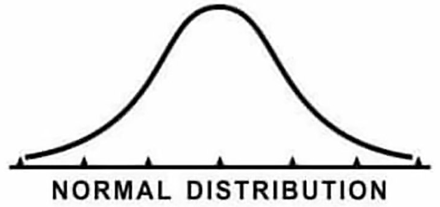
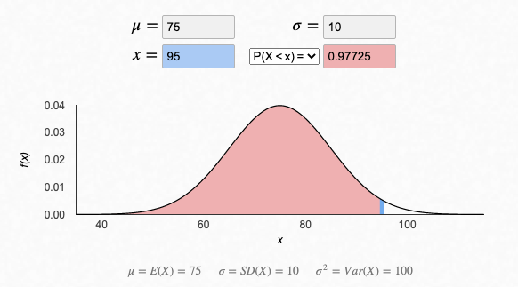
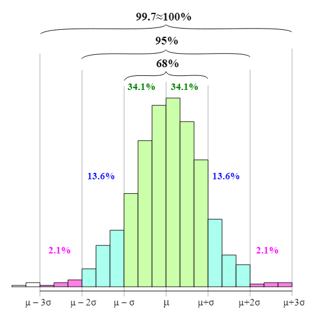
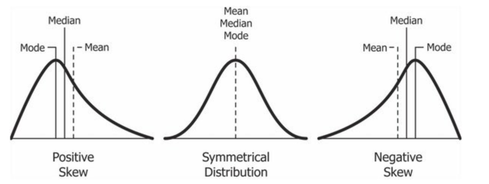
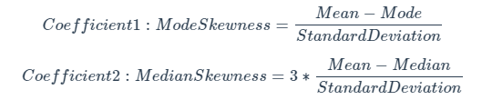

# Summary Statistics

## 1. Central Location Statitics

- By central location statistics here we are refering to Mean, Mode and Median values. They are all measure of central location summary often used in analytical reports.

### 1.1. Arithmetic Mean or Average

- Arithmetic mean is basically the sum of all values divided by the total count of values for a set of numbers.
- The mean is commonly used as a location summary statistic to show the central tendancy for a set of observations.

> SQL implementaton of mean is rather simpler as we use AVG funvtion to achieve it.

```sql
SELECT
  AVG(measure_value)
FROM health.user_logs;
```

Output:
| avg |
|--------------------|
| 1986.2288605267076 |

- By the looks of the mean value, something definitely seems off. Let's check the record counts for each measure

```sql
SELECT
  measure,
  COUNT(*) AS counts
FROM health.user_logs
GROUP BY measure
ORDER BY counts DESC;
```

Output:
| measure | counts |
|-----------------|--------|
| blood_glucose | 38692 |
| weight | 2782 |
| blood_pressure | 2417 |

- This definitely looks kinda fishy. Let's have a look at the AVG value across each measure too

```sql
SELECT
  measure,
  ROUND(AVG(measure_value), 2) AS average,
  COUNT(*) AS counts
FROM health.user_logs
GROUP BY measure
ORDER BY counts DESC;
```

Output:
| measure | average | counts |
|-----------------|----------|--------|
| blood_glucose | 177.35 | 38692 |
| **weight** | **28786.85** | 2782 |
| blood_pressure | 95.40 | 2417 |

- The mean weight seems very off. I'll keep this to the side and move onto the other topics for now.

## 2. Median & Mode

- These are two more central tendancy statistics that are different to the mean.

- The median shows the central location based off the values of the middle values, whilst the mode focuses on the most frequent values.

- The mode is simply calculated as the value that appears the most number of times

### 2.1. The Median Concept

#### Median Algorithm

- Firstly, all N observations of numbers are lined up from smallest to largest in a single line.

- To calculate the median we look at the number directly in the middle of this ordered line up.

- If N is odd, the middle number will be (N+1)/2.

- If N is even, N/2 and N/2 + 1 will be considered middle values. Taking the average of these two will give us the median value.

#### Mode Algorithm

- Calculate the tally of values similar to a GROUP BY and COUNT
- The mode is the values with the highest number of occurences

Example SQL Query:

```sql
WITH sample_data (example_values) AS (
 VALUES
 (82), (51), (144), (84), (120), (148), (148), (108), (160), (86)
)
SELECT
  AVG(example_values) AS mean_value,
  PERCENTILE_CONT(0.5) WITHIN GROUP (ORDER BY example_values) AS median_value,
  MODE() WITHIN GROUP (ORDER BY example_values) AS mode_value
from sample_data;
```

| mean_value           | median_value | mode_value |
| -------------------- | ------------ | ---------- |
| 113.1000000000000000 | 114          | 148        |

- If we use the same syntax to calculate our median and mode values for our health.user_logs

```sql
SELECT
  PERCENTILE_CONT(0.5) WITHIN GROUP (ORDER BY measure_value) AS median_value,
  MODE() WITHIN GROUP (ORDER BY measure_value) AS mode_value,
  AVG(measure_value) as mean_value
FROM health.user_logs
WHERE measure = 'weight';
```

Output:

| median_value | mode_value  | mean_value         |
| ------------ | ----------- | ------------------ |
| 75.976721975 | 68.49244787 | 28786.846657296002 |

- Again, as highlighted earlier, there's something fishy about the results we can see over here.

## 3. Spread of the Data

### 3.1. Min, Max and Range

- The minimum and maximum values of observations in a dataset help us identify the boundaries of where our data exists.

- Using the following SQL query we can calculate the Min, Max and Range of the given dataset.

```sql
SELECT
  MIN(measure_value) AS minimum_value,
  MAX(measure_value) AS maximum_value,
  MAX(measure_value) - MIN(measure_value) AS range_value
FROM health.user_logs
WHERE measure = 'weight';
```

**Execution Time: 15.583 ms**

Output:
| minimum_value | maximum_value | range_value |
|---------------|---------------|-------------|
| 0 | 39642120 | 39642120 |

- The following query is a rather optimized version of calculating Min, Max and Range for the health.user_logs dataset as it avoids calling of Min and Max funtions twice as in the above query.

```sql
EXPLAIN ANALYZE
WITH min_max_values AS (
  SELECT
    MIN(measure_value) AS minimum_value,
    MAX(measure_value) AS maximum_value
  FROM health.user_logs
  WHERE measure = 'weight'
)
SELECT
  minimum_value,
  maximum_value,
  maximum_value - minimum_value AS range_value
FROM min_max_values;
```

**Execution Time: 4.405 ms**

- Also by putting **EXPLAIN ANALYSE** in front of any query gives a brief analysis of metrics like **Execution time**

## 4. Variance & Standard Deviation

### 4.1. Variance Algorithm

- The variance is the sum of the (difference between each X value and the mean) squared, divided by N - 1, 1 less than the total number of values.

- Squaring the differences helps to create a meaningful measure of variability that accounts for both the size and direction of deviations from the mean.

- This is what it looks like in SQL:

```sql
WITH sample_data (example_values) AS (
 VALUES
 (82), (51), (144), (84), (120), (148), (148), (108), (160), (86)
)
SELECT
  ROUND(VARIANCE(example_values), 2) AS variance_value,
  ROUND(STDDEV(example_values), 2) AS standard_dev_value,
  ROUND(AVG(example_values), 2) AS mean_value,
  PERCENTILE_CONT(0.5) WITHIN GROUP (ORDER BY example_values) AS median_value,
  MODE() WITHIN GROUP (ORDER BY example_values) AS mode_value
FROM sample_data;
```

Output:
| variance_value | standard_dev_value | mean_value | median_value | mode_value |
|----------------|--------------------|------------|--------------|------------|
| 1340.99 | 36.62 | 113.10 | 114 | 148 |

### 4.2. Interpreting Spread

#### 4.2.1. Spread For Normal Distribution



- Normal distributions are encountered in various aspects of life, often without realizing it. One such example is students particularly preparing for competitive high school entrance exams. These exams are crucial for securing admission to prestigious schools, accepting only the top 120 students nationwide (the intake can be different based on various factors). Upon receiving results, percentile values are assigned to indicate performance relative to other test-takers. Percentiles are calculated based on

1. The average or the mean score of all exam takers
2. The spread or the standard deviation/variance of the score values

For example, if the author scored 95 on a test with an average of 75 and a standard deviation of 10, their percentile would be indicated on the chart.



### 4.3. The Empirical Rule or Confidence Intervals

- Other way to interpret the standard deviation is the **Empirical Rule**

- If the data is approximately normally distributed (looks like a bell curve) - we can make rough generalisations about how much percentage of the total lies between different ranges related to our standard deviation values.

- These boundaries are also known as confidence intervals or confidence bands.

| Percentage of Values | Range of Values |
| -------------------- | --------------- |
| 68%                  | μ±σ             |
| 95%                  | μ±2×σ           |
| 99.7%                | μ±3×σ           |



## 5. Calculating All The Summary Statistics

```sql
SELECT
  'weight' AS measure,
  ROUND(MIN(measure_value), 2) AS minimum_value,
  ROUND(MAX(measure_value), 2) AS maximum_value,
  ROUND(AVG(measure_value), 2) AS mean_value,
  ROUND(
    -- this function actually returns a float which is incompatible with ROUND!
    -- we use this cast function to convert the output type to NUMERIC
    CAST(PERCENTILE_CONT(0.5) WITHIN GROUP (ORDER BY measure_value) AS NUMERIC),
    2
  ) AS median_value,
  ROUND(
    MODE() WITHIN GROUP (ORDER BY measure_value),
    2
  ) AS mode_value,
  ROUND(STDDEV(measure_value), 2) AS standard_deviation,
  ROUND(VARIANCE(measure_value), 2) AS variance_value
FROM health.user_logs
WHERE measure = 'weight';
```

Output:
| measure | minimum_value | maximum_value | mean_value | median_value | mode_value | standard_deviation | variance_value |
|---------|---------------|---------------|------------|--------------|------------|--------------------|----------------|
| weight | 0.00 | 39642120.00 | 28786.85 | 75.98 | 68.49 | 1062759.55 | 1129457862383.41 |

## 6. Exercises

For this tutorial we have focused on the filtered records WHERE measure = 'weight'

### 6.1. Average, Median & Mode

One popular method to detect an uneven distribution in the dataset is to compare the average, mode and median values - this statistical property is known as a skew in the distribution.



1. What is the average, median and mode values of blood glucose values to 2 decimal places?

```sql
SELECT
  ROUND(CAST(PERCENTILE_CONT(0.5) WITHIN GROUP (ORDER BY measure_value) AS NUMERIC), 2) AS median_value,
  ROUND(MODE() WITHIN GROUP (ORDER BY measure_value), 2) AS mode_value,
  ROUND(AVG(measure_value), 2) AS mean_value
FROM
  health.user_logs
WHERE
  measure = 'blood_glucose';
```

Output:

| median_value | mode_value | mean_value |
| ------------ | ---------- | ---------- |
| 154.00       | 401.00     | 177.35     |

### 6.2. Most Frequent Values

2. What is the most frequently occuring measure_value value for all blood glucose measurements?

```sql
SELECT
  measure_value AS measurements,
  COUNT(*) AS frequency
FROM
  health.user_logs
WHERE
  measure = 'blood_glucose'
GROUP BY
  measure_value
ORDER BY
  frequency DESC
LIMIT
  10;
```

Output:
| measure_value | frequency |
|---------------|-----------|
| 401 | 433 |
| 117 | 350 |
| 118 | 307 |
| 115 | 290 |
| 126 | 290 |
| 122 | 289 |
| 108 | 287 |
| 123 | 283 |
| 125 | 282 |
| 120 | 281 |

### 6.3. Pearson Coefficients of Skewness

3. Calculate the 2 Pearson Coefficient of Skewness for blood glucose measures given the following formulas:



```sql
WITH metric_data AS (
  SELECT
    AVG(measure_value) AS mean_value,
    MODE() WITHIN GROUP (ORDER BY measure_value) AS mode_value,
    CAST(PERCENTILE_CONT(0.5) WITHIN GROUP (ORDER BY measure_value) AS NUMERIC) AS median_value,
    STDDEV(measure_value) AS standard_deviation
  FROM
    health.user_logs
  WHERE
    measure = 'blood_glucose'
)
SELECT
  (mean_value - mode_value) / standard_deviation AS pearson_coef_1,
  3 * (mean_value - median_value) / standard_deviation AS pearson_coef_2
FROM
  metric_data;
```

Output:

| pearson_coef_1          | pearson_coef_2      |
| ----------------------- | ------------------- |
| -0.19324890033272552535 | 0.06052397102651671 |
