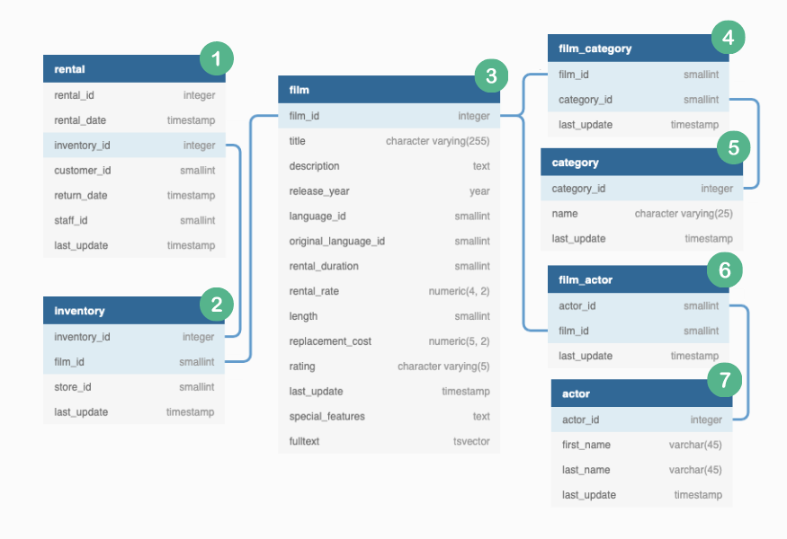

# Marketing Analytics Case Study

**Situation:** The leadership team at DVD Rental Co has embarked on a venture to enhance customer engagement through personalized email campaigns driven by marketing analytics. Our task involves aiding the customer analytics team in gathering essential data points crucial for crafting targeted emails.

This case study delves into various SQL techniques for data manipulation and analysis. It aims to broaden your understanding of SQL while presenting opportunities to apply clever tricks acquired through experience.

## 1. Key Business Requirements:

### Requirement #1: Top 2 Categories

- **Objective**: Identify the top 2 categories for each customer based on their rental history.
- **Data Points Needed**:
  - Top 2 categories for each customer.
- **Purpose**: Drive marketing creative images in the email template.

### Requirement #2: Category Film Recommendations

- **Objective**: Provide film recommendations for the top 2 categories of each customer.
- **Data Points Needed**:
  - 3 most popular films for each of the customer’s top 2 categories.
  - Exclude films already viewed by the customer.
  - Flag customers with no film recommendations.
- **Purpose**: Populate film recommendations section in the email template.

### Requirement #3 & #4: Individual Customer Insights

- **Objective**: Provide insights into each customer’s film-watching behavior.
- **Data Points Needed**:
  - Total films watched in the top category.
  - Comparison with average DVD Rental Co customer.
  - Ranking percentile in the category.
  - Total films watched in the second ranking category.
  - Proportion of total films watched in this category.
- **Purpose**: Offer personalized insights into customers’ film preferences.

### Requirement #5: Favorite Actor Recommendations

- **Objective**: Recommend films featuring the customer’s favorite actors.
- **Data Points Needed**:
  - Up to 3 additional film recommendations per actor.
  - Count of films featuring the top actor.
  - Alphabetical tie-breaking rule.
  - Exclude films already recommended in top 2 categories.
  - Flag customers with no actor recommendations.
- **Purpose**: Enhance film recommendations with favorite actor choices.

## 2. Understanding The Data

### 2.1. Data Exploration



Here are the following key things to note about ERDs:

1. It shows all the column names as well as there data type for each table.
2. Table indexes and foreign keys are highlighted to show the relationships between tables.

Let's take a deep dive at what each table (here, the _dvd_rentals_ tables) is about.

### Table #1 - rental

- This contains the rental data points at customer level
- There is a unique squential `rental_id` for each record in the table.
- Each `rental_id` corresponds to an individual `customer_id` purchasing or renting a specific item with an `inventory_id`.
- There is also information about the `rental_date` and `return_date` as well as which staff member served the customer(`staff_id`)

Here's how the table looks like:

```sql
SELECT *
FROM dvd_rentals.rental
WHERE customer_id = 130
LIMIT 5;
```

Output:
| rental_id | rental_date | inventory_id | customer_id | return_date | staff_id | last_update |
|-----------|---------------------|--------------|-------------|---------------------|----------|--------------------|
| 1 | 2005-05-24 22:53:30 | 367 | 130 | 2005-05-26 22:04:30 | 1 | 2006-02-15 21:30:53|
| 746 | 2005-05-29 09:25:10 | 4272 | 130 | 2005-06-02 04:20:10 | 2 | 2006-02-15 21:30:53|
| 1630 | 2005-06-16 07:55:01 | 2413 | 130 | 2005-06-19 06:38:01 | 1 | 2006-02-15 21:30:53|
| 1864 | 2005-06-17 01:39:47 | 1815 | 130 | 2005-06-24 19:39:47 | 2 | 2006-02-15 21:30:53|
| 2163 | 2005-06-17 23:46:16 | 2600 | 130 | 2005-06-22 22:48:16 | 2 | 2006-02-15 21:30:53|

### Table #2 - inventory

- The inventory dataset consists of the relationship between specific items available for rental at each store. (there might be multiple inventory items for a specific film at a unique store)
- For instance, a specific film 'X' might have 4 copies at store#1 and an additional 4 copies at store#2 - each record will have separate `inventory_id` whilst `film_id` will remain the same and `store_id` will change according to the store number.
- This inventory table is linked to the previous rental table via `inventory_id` which is an integer datatype.

Here's how the table looks like:

```sql
SELECT *
FROM dvd_rentals.inventory
WHERE film_id = 1;
```

Output:
| inventory_id | film_id | store_id | last_update |
|--------------|---------|----------|--------------------|
| 1 | 1 | 1 | 2006-02-15 05:09:17|
| 2 | 1 | 1 | 2006-02-15 05:09:17|
| 3 | 1 | 1 | 2006-02-15 05:09:17|
| 4 | 1 | 1 | 2006-02-15 05:09:17|
| 5 | 1 | 2 | 2006-02-15 05:09:17|
| 6 | 1 | 2 | 2006-02-15 05:09:17|
| 7 | 1 | 2 | 2006-02-15 05:09:17|
| 8 | 1 | 2 | 2006-02-15 05:09:17|

### Table #3 - film

- The film table which helps us identify the title of films rented by DVD Rental Co customers. The film title, description as well as special features and other fields are available for further analysis.
- The `rental_rate` column which represents the cost of each rental - something which could be useful if we wanted to look at the sales performance of DVD Rental Co.
- `film_id` column can be used to help us join onto table #4 film_actor to help us identify which actors appeared in each film.

```sql
SELECT *
FROM dvd_rentals.film
LIMIT 5;
```

Output:
| film_id | title | description | release_year | language_id | original_language_id | rental_duration | rental_rate | length | replacement_cost | rating | last_update | special_features | fulltext |
|---------|---------------------|-----------------------------------------------------------------------------------------------------------------|--------------|-------------|----------------------|-----------------|-------------|--------|------------------|--------|----------------------|------------------------------------|-------------------------------------------------------------------------------------------------------------------------------------------------------|
| 1 | ACADEMY DINOSAUR | A Epic Drama of a Feminist And a Mad Scientist who must Battle a Teacher in The Canadian Rockies | 2006 | 1 | null | 6 | 0.99 | 86 | 20.99 | PG | 2006-02-15 05:03:42 | {"Deleted Scenes","Behind the Scenes"} | 'academi':1 'battl':15 'canadian':20 'dinosaur':2 'drama':5 'epic':4 'feminist':8 'mad':11 'must':14 'rocki':21 'scientist':12 'teacher':17 |
| 2 | ACE GOLDFINGER | A Astounding Epistle of a Database Administrator And a Explorer who must Find a Car in Ancient China | 2006 | 1 | null | 3 | 4.99 | 48 | 12.99 | G | 2006-02-15 05:03:42 | {Trailers,"Deleted Scenes"} | 'ace':1 'administr':9 'ancient':19 'astound':4 'car':17 'china':20 'databas':8 'epistl':5 'explor':12 'find':15 'goldfing':2 'must':14 |
| 3 | ADAPTATION HOLES | A Astounding Reflection of a Lumberjack And a Car who must Sink a Lumberjack in A Baloon Factory | 2006 | 1 | null | 7 | 2.99 | 50 | 18.99 | NC-17 | 2006-02-15 05:03:42 | {Trailers,"Deleted Scenes"} | 'adapt':1 'astound':4 'baloon':19 'car':11 'factori':20 'hole':2 'lumberjack':8,16 'must':13 'reflect':5 'sink':14 |
| 4 | AFFAIR PREJUDICE | A Fanciful Documentary of a Frisbee And a Lumberjack who must Chase a Monkey in A Shark Tank | 2006 | 1 | null | 5 | 2.99 | 117 | 26.99 | G | 2006-02-15 05:03:42 | {Commentaries,"Behind the Scenes"} | 'affair':1 'chase':14 'documentari':5 'fanci':4 'frisbe':8 'lumberjack':11 'monkey':16 'must':13 'prejudic':2 'shark':19 'tank':20 |
| 5 | AFRICAN EGG | A Fast-Paced Documentary of a Pastry Chef And a Dentist who must Pursue a Forensic Psychologist in The Gulf of Mexico | 2006 | 1 | null | 6 | 2.99 | 130 | 22.99 | G | 2006-02-15 05:03:42 | {"Deleted Scenes"} | 'african':1 'chef':11 'dentist':14 'documentari':7 'egg':2 'fast':5 'fast-pac':4 'forens':19 'gulf':23 'mexico':25 'must':16 'pace':6 'pastri':10 'psychologist':20 'pursu':17 |

### Table #4 - film_category

- The film_category shows the relationship between film_id and category_id.

```sql
SELECT *
FROM dvd_rentals.film_category
LIMIT 5;
```

Output:
| film_id | category_id | last_update |
|---------|-------------|----------------------|
| 1 | 6 | 2006-02-15 05:07:09 |
| 2 | 11 | 2006-02-15 05:07:09 |
| 3 | 6 | 2006-02-15 05:07:09 |
| 4 | 11 | 2006-02-15 05:07:09 |
| 5 | 8 | 2006-02-15 05:07:09 |

### Table #5 - category

- The category table simply contains a one to one mapping between `category_id` and the name of each category.

```sql
SELECT *
FROM dvd_rentals.category
LIMIT 5;
```

Output:
| category_id | name | last_update |
|-------------|------------|----------------------|
| 1 | Action | 2006-02-15 04:46:27 |
| 2 | Animation | 2006-02-15 04:46:27 |
| 3 | Children | 2006-02-15 04:46:27 |
| 4 | Classics | 2006-02-15 04:46:27 |
| 5 | Comedy | 2006-02-15 04:46:27 |

### Table #6 - film_actor

- The film_actor shows actors who appeared in each film based off related actor_id and film_id values.

```sql
SELECT *
FROM dvd_rentals.film_actor
WHERE actor_id = 1;
```

Output:
| actor_id | film_id | last_update |
|----------|---------|----------------------|
| 1 | 1 | 2006-02-15 05:05:03 |
| 1 | 23 | 2006-02-15 05:05:03 |
| 1 | 25 | 2006-02-15 05:05:03 |
| 1 | 106 | 2006-02-15 05:05:03 |
| 1 | 140 | 2006-02-15 05:05:03 |
| 1 | 166 | 2006-02-15 05:05:03 |
| 1 | 277 | 2006-02-15 05:05:03 |
| 1 | 361 | 2006-02-15 05:05:03 |
| 1 | 438 | 2006-02-15 05:05:03 |
| 1 | 499 | 2006-02-15 05:05:03 |
| 1 | 506 | 2006-02-15 05:05:03 |
| 1 | 509 | 2006-02-15 05:05:03 |
| 1 | 605 | 2006-02-15 05:05:03 |
| 1 | 635 | 2006-02-15 05:05:03 |
| 1 | 749 | 2006-02-15 05:05:03 |
| 1 | 832 | 2006-02-15 05:05:03 |
| 1 | 939 | 2006-02-15 05:05:03 |
| 1 | 970 | 2006-02-15 05:05:03 |
| 1 | 980 | 2006-02-15 05:05:03 |

### Table #7 - actor

- The actor table simply shows the first and last name for each actor based off their unique `actor_id`
- We can trace which films a specific actor appears in by joining this table onto the previously discussed film_actor table on the `actor_id` column.

```sql
SELECT *
FROM dvd_rentals.actor
LIMIT 5;
```

Output:
| actor_id | first_name | last_name | last_update |
|----------|------------|--------------|----------------------|
| 1 | PENELOPE | GUINESS | 2006-02-15 04:34:33 |
| 2 | NICK | WAHLBERG | 2006-02-15 04:34:33 |
| 3 | ED | CHASE | 2006-02-15 04:34:33 |
| 4 | JENNIFER | DAVIS | 2006-02-15 04:34:33 |
| 5 | JOHNNY | LOLLOBRIGIDA | 2006-02-15 04:34:33 |
